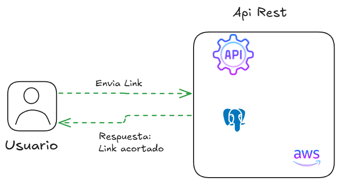

# Shortlinks
Proyecto realizado enfocado para la creación de un servicio de Acortador de Links. 

**URL de la API desplegada**: <a href="https://linksfast.site/" target="_blank">https://linksfast.site/</a>

## ¿Cómo funciona?
**:one: Envío del enlace a acortar:**
    El usuario proporciona un enlace original que desea acortar y lo envía a la API REST mediante un endpoint específico.

**:two: Procesamiento del enlace:**
La API REST recibe el enlace original, genera un enlace acortado único, y almacena ambos enlaces en la base de datos.
Posteriormente, la API responde al usuario con el enlace acortado generado.

**:three: Redirección y seguimiento:**
Cuando un usuario accede al enlace acortado, la API REST identifica el enlace original asociado en la base de datos.
Redirige automáticamente al usuario al enlace original.
Simultáneamente, incrementa un contador de visitas para ese enlace acortado, registrando las estadísticas para su análisis posterior.




# Tecnologías

<div>
    
    
    
    
</div>

La API REST fue desarrollada utilizando JavaScript con el framework Node.js y Express.js. La gestión de la base de datos se implementó con PostgreSQL, asegurando un manejo eficiente de los datos. Para la autenticación y autorización de usuarios, se utilizó JWT (JSON Web Tokens), proporcionando un nivel adicional de seguridad. El despliegue de la aplicación se realizó en AWS EC2, garantizando escalabilidad y disponibilidad.

# Despliegue

Para desplegar la aplicación, sigue los siguientes pasos:

1. Clona el repositorio en tu máquina local.
2. Abre una terminal y navega hasta el directorio del proyecto.
3. Ejecuta el siguiente comando para instalar las dependencias necesarias:

```
npm install
```

4. Crea un archivo .env en la raíz del proyecto con las siguientes variables de entorno:

```
HOST = "xxxx"
PORT = xxxx

DATABASE_USER = "xxxxx"
PASSWORD = "xxxx"
DATABASE = "xxxxx"
DATABASE_HOST = "xxxx"
DATABASE_PORT = xx


SECRET_JWT_SEED = "222xxxxxxxxxxxxxxxxxxx222"
ROLE_ID_DEFAULT = 3

```

5. Ejecuta el siguiente comando para iniciar el servidor:

```
node index.js
```